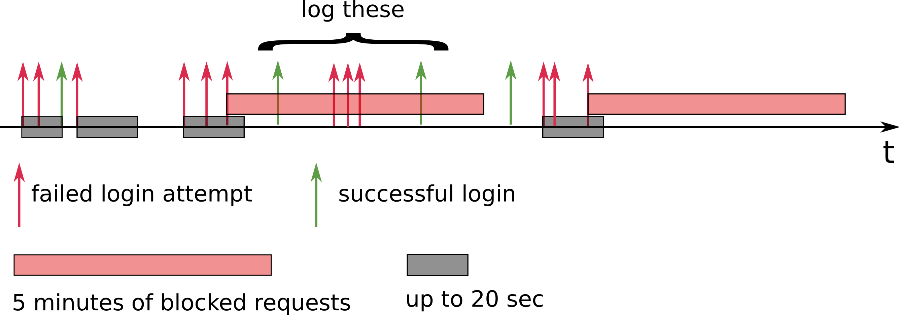

# Table of Contents
1. [Challenge Summary](README.md#challenge-summary)
2. [Details of Implementation](README.md#details-of-implementation)
3. [Download Data](README.md#download-data)
4. [Description of Data](README.md#description-of-data)
5. [Repo directory structure](README.md#repo-directory-structure)

# Challenge Summary

Picture yourself as a backend engineer for a NASA fan website that generates a large amount of Internet traffic data. Your challenge is to perform basic analytics on the server log file, provide useful metrics, and implement basic security measures. 

The desired features are described below: 

### Feature 1: 
List the top 10 most active host/IP addresses that have accessed the site.

### Feature 2: 
Identify the 10 resources that consume the most bandwidth on the site

### Feature 3:
List the top 10 busiest (or most frequently visited) 60-minute periods 

### Feature 4: 
Detect patterns of three failed login attempts from the same IP address over 20 seconds so that all further attempts to the site can be blocked for 5 minutes. Log those possible security breaches.

### Feature 5: 
This add-on feature lists the daily hits to the server in the ascending order of the dates to generate time series data.

### Other considerations and optional features
It's critical that these features don't take too long to run. For example, if it took too long to detect three failed login attempts, further traffic from the same IP address couldn’t be blocked immediately, and that would present a security breach.
This dataset is inspired by real NASA web traffic, which is very similar to server logs from e-commerce and other sites. Monitoring web traffic and providing these analytics is a real business need, but it’s not the only thing you can do with the data. Feel free to implement additional features that you think might be useful.

## Details of Implementation
I have implemented the code in such a manner that the data is treated as streaming data. So I am processing each log one by one and updating the asked feature values accordingly. Hence, if someone wants to check output of the features in real-time or build a real-time dashboard showing these features' values, it's vary easy to build from my model of program. I have error handled the code such that, in case of any exceptions (eg. Keyboard interrupt) or error, the code will exit smoothly and will also generate features based on the data processed till that time.

With this approach, I am also able to save a lot of memory since only minimal data will be in memory at a moment. And this gives an opportunity to scale up the analysis ability of this code. Because, if the log size is too large to fit in local system, we can not perform analysis after reading and storing details of all the logs and then perform analysis.  

However, trade-off of this approach is that it makes too many function calls, too many arguments passing which is making the overall analysis slow. But it is speedy enough to make real-time decision like feature 4 if breach is found. Using HashMaps and Heaps have given me a huge advantage in terms of running time. Since I have considered this data as a streaming data, I had to build my own version of Python default `heapq.nlargest()` called  `top_k_elements()`.

So this approach is well-suitable for real world scenario even if the overall execution time might be slow compared to other solutions.

My code is such that it can run on distributed systems as well using MapReduce functions. It's also modular such that there is a seperate function to generate each feature. I have also developed some utily function, eg. `top_k_elements`, `str_to_ts`, `ts_to_str`, `sort_heap`, and `decompose_server_log` to make the code as disconnected as possible.

### Feature 1 
List in descending order the top 10 most active hosts/IP addresses that have accessed the site.

Write to a file, named `hosts.txt`, the 10 most active hosts/IP addresses in descending order and how many times they have accessed any part of the site. There should be at most 10 lines in the file, and each line should include the host (or IP address) followed by a comma and then the number of times it accessed the site. 

e.g., `hosts.txt`:

    example.host.com,1000000
    another.example.net,800000
    31.41.59.26,600000
    …
  
#### Solving feature 1:  
I am building a HashMap - Python Dictionary to store the count of the number of requests from each host. I am updating the count whenever new log arrives and also updating the top hosts accordingly. To find the host from log, I am using `split` method instead of using regular expressions, since regex are expensive and it's easy to extract host name from server log in our case. I am using `heap` to store and mantain top K hosts. This gives a significant advantage in running time for finding top K elements from performing sorting and then extracting top K elements. This is also a perfect approach if the data is streaming data. To resolve ties, I am following lexical order. This feature is implemented mainly using `top_k_elements` in the `process_log.py`.

### Feature 2 
Identify the top 10 resources on the site that consume the most bandwidth. Bandwidth consumption can be extrapolated from bytes sent over the network and the frequency by which they were accessed.

These most bandwidth-intensive resources, sorted in descending order and separated by a new line, should be written to a file called `resources.txt`

e.g., `resources.txt`:
    
    /images/USA-logosmall.gif
    /shuttle/resources/orbiters/discovery.html
    /shuttle/countdown/count.html
    …

#### Solving feature 2:
Similar to feature 1, I am maintaining the count of accessed resources in HashMap, and updating and maintaining top K resources using Heap. The difference here is in extracting the resource. I am using regex to find the accessed resource since it is highly error-prone to use any other method. For this, I am extracting the whole HTTP request using regex and then extracting resource from split method of the string. If the request is not in a proper format, I am printing it out in the console and discarding that whole server log for any further analysis on it. To resolve ties, I am following lexical order. This feature is implemented mainly using `top_k_elements` in the `process_log.py`.

### Feature 3 
List in descending order the site’s 10 busiest (i.e. most frequently visited) 60-minute period.

Write to a file named `hours.txt`, the start of each 60-minute window followed by the number of times the site was accessed during that time period. The file should contain at most 10 lines with each line containing the start of each 60-minute window, followed by a comma and then the number of times the site was accessed during those 60 minutes. The 10 lines should be listed in descending order with the busiest 60-minute window shown first. 

e.g., `hours.txt`:

    01/Jul/1995:00:00:01 -0400,100
    02/Jul/1995:13:00:00 -0400,22
    05/Jul/1995:09:05:02 -0400,10
    01/Jul/1995:12:30:05 -0400,8
    …

A 60-minute window can be any 60 minute long time period, windows don't have to start at a time when an event occurs.

#### Solving feature 3:  
This was the most complicated feature to implement as there are many assumptions to make and multiple answers are possible. I emailed to administrative team of the coding challenge and based on their reply, I implemented my approach. 

Assumption made: 1) Windows can overlap 2) Starting time of the window will also be a strating time of some event, if I don't assume this, there can be multiple correct answers possible for thie feature. 

Implementation: I am extracting the timestamp using regex and converting it to datetime object of python using strptime (Edit: Not using it anymore) method. By profiling the code, I can see that these tasks are taking the maximum time to execute compared to other tasks, but at this moment, I am going with these safe approaches to perform extraction and conversion of timestamp. After extracting timestamp, I am building a HashMap of each unique timestamp and calculating the number of server logs in 60 minute time windows which starts from that timestamp. To find the number of logs in the windows, I am using `deque` collection of python, since it's optimized to run sliding window of 60 minute to find the numbers of logs. Whenever a new log comes, I am checking the current entries in this 60 minute sliding window deque, and removing the entries from left which don't belong to 60 minute window ending at a time when the new log arrived. This gives me a linear running time to find the number of logs in each 60 minute window and then I am using Heap to find top K busiest 60 minute time window, just like feature 2 and 3. This feature is mainly implemented through function `find_busiest_windows` in the `process_log.py`.

### Feature 4 
Your final task is to detect patterns of three consecutive failed login attempts over 20 seconds in order to block all further attempts to reach the site from the same IP address for the next 5 minutes. Each attempt that would have been blocked should be written to a log file named `blocked.txt`.

The site’s fictional owners don’t expect you to write the actual web server code to block the attempt, but rather want to gauge how much of a problem these potential security breaches represent. 

Detect three failed login attempts from the same IP address over a consecutive 20 seconds, and then write to the `blocked.txt` file any subsequent attempts to reach the site from the same IP address over the next 5 minutes. 

For example, if the third consecutive failed login attempt within a 20 second window occurred on `01/Aug/1995:00:00:08`, all access to the website for that IP address would be blocked for the next 5 minutes. Even if the same IP host attempted a login -- successful or not -- one minute later at `01/Aug/1995:00:01:08`, that attempt should be ignored and logged to the `blocked.txt` file. Access to the site from that IP address would be allowed to resume at `01/Aug/1995:00:05:09`.

If an IP address has not reached three failed login attempts during the 20 second window, a login attempt that succeeds during that time period should reset the failed login counter and 20-second clock. 

For example, if after two failed login attempts, a third login attempt is successful, full access should be allowed to resume immediately afterward. The next failed login attempt would be counted as 1, and the 20-second timer would begin there. In other words, this feature should only be triggered if an IP has  3 failed logins in a row, within a 20-second window.

e.g., `blocked.txt`

    uplherc.upl.com - - [01/Aug/1995:00:00:07 -0400] "GET / HTTP/1.0" 304 0
    uplherc.upl.com - - [01/Aug/1995:00:00:08 -0400] "GET /images/ksclogo-medium.gif HTTP/1.0" 304 0
    …

The following illustration may help you understand how this feature might work, and when three failed login attempts would trigger 5 minutes of blocking:

Note that this feature should not impact the other features in this challenge. For instance, any requests that end up in the `blocked.txt` file should be counted toward the most active IP host calculation, bandwidth consumption and busiest 60-minute period.

#### Solving feature 4:
This was relatively easy to implement. I am maintaining two HashMaps, one to maintain entries of host names which are currently in blocked state after failing 3 consecutive login attempts and other to maintain hostnames which are flagged and observed as they made failed login attempt. This flag remains intact for 20 seconds unless successful login is done. For each server log, I am checking if the host is in blocked category. If yes, I am logging all the upcoming requests from that hostname for 5 minutes since the last failed login attempt. If it isn't in blocked list, I check for flag status, and make updates to flag list and decide if the latest server log entry should be logged or not. This feature is implemented mainly by `blocked` function in the `process_log.py`.

### Feature 5
List in daily hits on the website in ascending order of the date

Write to a file named `dailyhits.txt`, the count of daily total hits to the website in the ascending order of the date. This feature helps to create a time-series, which can be analyzed for purposes like when the load to the server is highest, lowest etc. Based on this data, we can make decision for scaling up or down of the hosting server 

e.g., `dailyhits.txt`:

    01/Jul/1995,10000
    02/Jul/1995,2000
    03/Jul/1995:450544
    04/Jul/1995:6562
    …

Solving feature 5:
I am using the same approach as used in feature 1,2,3, that use a `Counter` (subclass of Python dictionary) to store the count. And at the end I am printing the solution in ascending order of the dates.

### Additional Features

Feel free to implement additional features that might be useful to derive further metrics or prevent harmful activity. These features will be considered as bonus while evaluating your submission. If you choose to add extras please document them in your README and make sure that they don't interfere with the above four (e.g. don't alter the output of the four core features).

## Download Data
You can download the data here: https://drive.google.com/file/d/0B7-XWjN4ezogbUh6bUl1cV82Tnc/view

## Description of Data

Assume you receive as input, a file, `log.txt`, in ASCII format with one line per request, containing the following columns:

* **host** making the request. A hostname when possible, otherwise the Internet address if the name could not be looked up.

* **timestamp** in the format `[DD/MON/YYYY:HH:MM:SS -0400]`, where DD is the day of the month, MON is the abbreviated name of the month, YYYY is the year, HH:MM:SS is the time of day using a 24-hour clock. The timezone is -0400.

* **request** given in quotes.

* **HTTP reply code**

* **bytes** in the reply. Some lines in the log file will list `-` in the bytes field. For the purposes of this challenge, that should be interpreted as 0 bytes.

e.g., `log.txt`

    in24.inetnebr.com - - [01/Aug/1995:00:00:01 -0400] "GET /shuttle/missions/sts-68/news/sts-68-mcc-05.txt HTTP/1.0" 200 1839
    208.271.69.50 - - [01/Aug/1995:00:00:02 -400] "POST /login HTTP/1.0" 401 1420
    208.271.69.50 - - [01/Aug/1995:00:00:04 -400] "POST /login HTTP/1.0" 200 1420
    uplherc.upl.com - - [01/Aug/1995:00:00:07 -0400] "GET / HTTP/1.0" 304 0
    uplherc.upl.com - - [01/Aug/1995:00:00:08 -0400] "GET /images/ksclogo-medium.gif HTTP/1.0" 304 0
    ...
    
In the above example, the 2nd line shows a failed login (HTTP reply code of 401) followed by a successful login (HTTP reply code of 200) two seconds later from the same IP address.

## Repo directory structure

The directory structure for your repo should look like this:

    ├── README.md 
    ├── run.sh
    ├── src
    │   └── process_log.py
    ├── log_input
    │   └── log.txt
    ├── log_output
    |   └── hosts.txt
    |   └── hours.txt
    |   └── resources.txt
    |   └── blocked.txt
    ├── insight_testsuite
        └── run_tests.sh
        └── tests
            └── test_features
            |   ├── log_input
            |   │   └── log.txt
            |   |__ log_output
            |   │   └── hosts.txt
            |   │   └── hours.txt
            |   │   └── resources.txt
            |   │   └── blocked.txt
            ├── your-own-test
                ├── log_input
                │   └── your-own-log.txt
                |__ log_output
                    └── hosts.txt
                    └── hours.txt
                    └── resources.txt
                    └── blocked.txt
